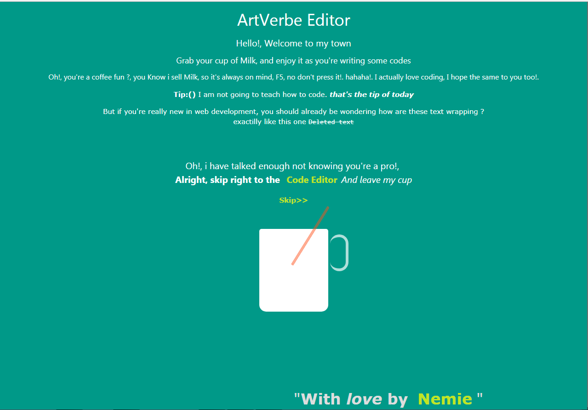

# simple web editor With auto Run  
## Image Intro
 
 <b stle="font-weight:bolder"> Demo Image With Auto Run </b>
 
<b stle="font-weight:bolder"> Demo Image With Auto Run Disabled </b>
 
 <b stle="font-weight:bolder"> I know you expected more but why can't go there right away <a href='https://simplewebeditor.netlify.com'>simplewebeditor</a> </b>
 